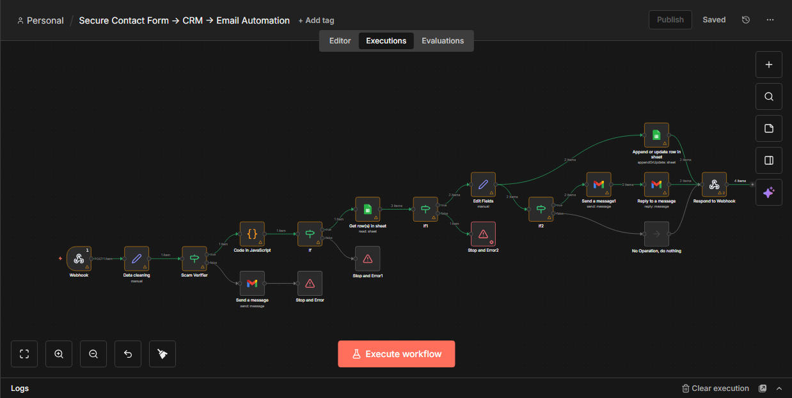

# Secure Contact Form → CRM → Email Automation (n8n)

This project is a **production-ready n8n automation** that handles website contact form submissions securely and reliably.

It validates incoming data, blocks spam and abuse, stores leads in a CRM (Google Sheets), and sends conditional email notifications — **without using AI**.

---

## 🔧 Features

- 🔐 Secure webhook with token validation  
- 🚫 Spam & disposable email blocking  
- ⏱ IP-based rate limiting using workflow static data  
- ✅ Field-level validation (email, message, service, name)  
- 🧠 Logic-based lead scoring (Hot / Warm / Cold)  
- 📊 CRM storage with deduplication (Google Sheets)  
- ✉️ Automated admin & user email notifications  
- 🔁 Update existing leads instead of duplicating  
- 🌐 Webhook response handling  

---

## 🧩 Workflow Overview

The automation follows a real-world backend architecture:

---

## 📸 Screenshot

Below is a screenshot of the complete n8n workflow:

---

## 📂 CRM Structure

The workflow uses a Google Sheets CRM with fields such as:

- Lead ID  
- Name & Email  
- Service Requested  
- Lead Score & Lead Type  
- Status (New / Contacted / Qualified)  
- Source & IP Address  
- Timestamps  

This makes the system easy to manage and hand over to clients.

---

## 🚀 Use Cases

- Website contact form backend  
- Agency lead management system  
- Secure inquiry handling  
- Anti-spam form automation  
- Small business CRM pipeline  

---

## ⚠️ Notes

- All credentials, tokens, and webhook URLs are **placeholders**
- No paid APIs are required
- Designed to be easily extended or customized per client

---

## 🏁 Status

✅ Complete  
✅ Tested with multiple payloads  
✅ Portfolio-ready  

---

## 📬 Author

Built by **Hassan Rizwan**  
Focused on building real-world, client-ready automations with n8n.

